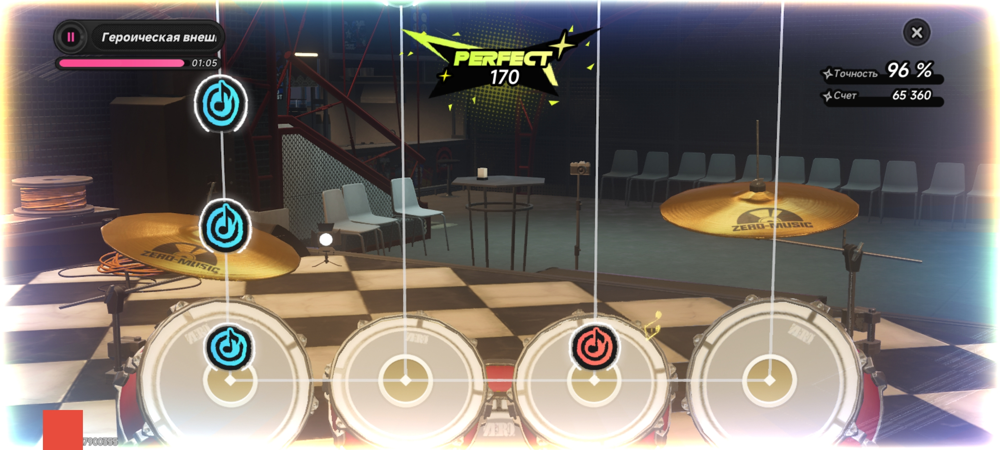

# NTE-scripts

  🌐
  <a href="./README.md"><b>English</b></a>
  &nbsp;·&nbsp;
  <a href="./README_RU.md">Русский</a>

A collection of scripts that make playing NTE on Android more convenient, faster, and easier.

NTE-scripts is a collection of different scripts that simplify playing NTE on Android.

This repository was created to store useful solutions, notes, and supporting materials related to the Android version of NTE.

  
  
  
  

## Contents

1. [Disclaimer](#disclaimer)
2. [Installation](#installation)
3. [Script list](#script-list)
4. [Recommendations](#recommendations)
5. [License](#license)

## Disclaimer

The materials in this repository are intended for informational purposes, personal use, and testing.

The author is not responsible for any possible consequences of using the scripts. All actions are performed by the user independently and at their own risk.

NTE-scripts is an unofficial user project and is not affiliated with the developers or publishers of NTE.

Using automation may violate the game rules or terms of service. The author of the project is not responsible for possible account restrictions, loss of progress, or any other consequences related to using the scripts.

## Installation

1. Download Macroify from <a href="https://play.google.com/store/apps/details?id=com.kok_emm.mobile&hl=ru&pli=1">Google Play</a>.

2. Grant all permissions requested by Macroify.

3. Create a new script and choose a name for it.
 

4. Select landscape orientation.
 

5. Select the game name "NTE".
 

6. The script will appear in the main menu. Tap edit.
 

7. Select the "multifunctional" mode.
 

8. Open the script editor menu and tap the ƒ{} icon.
 

9. Tap the second icon from the left, "&lt;&gt;".
 

10. Paste the script code from the txt file downloaded from <a href="https://github.com/Datvex/NTE-scripts/releases">releases</a>.
 

11. After pasting the code, tap the save icon in the control menu and then exit the code editor.
 

12. Then tap the cross icon in the script control panel and select "Save and exit".

13. After that, tap the "start" button.
 

14. A control menu will appear. Open NTE, go to the required mode, and then tap the triangle icon in the script control menu to start the script.

## Script list

### 1. Auto-fishing

  

**Auto-fishing** is a fishing automation script.

The script handles repetitive actions during fishing and helps make the process more stable, faster, and more convenient without constant manual control. It automatically performs the main fishing cycle, waits for the game's response, taps the required elements, and repeats the process after each attempt is completed.

<a href="https://github.com/Datvex/NTE-scripts/releases/tag/1.0.0">Download Auto-fishing 1.0.0</a>

### 2. SuperSound

  

**SuperSound** is a script for quickly completing levels in the **Super Sound** rhythm mini-game in NTE.

The script helps complete levels faster by automating repetitive actions during the mini-game and reducing the need for constant manual control.

<a href="https://github.com/Datvex/NTE-scripts/releases/tag/1.O.O">Download SuperSound 1.0.0</a>

## Recommendations

For stable script operation, it is recommended to:

* do not change the interface position while the script is running
* do not minimize the game
* disable pop-up notifications
* use a stable internet connection
* prepare enough required resources in advance
* do not run other apps over the game

## License

The project is distributed under the **GPL 3.0** license.

See the <a href="./LICENSE">LICENSE</a> file for details.
