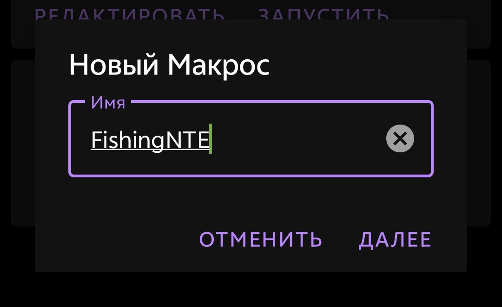
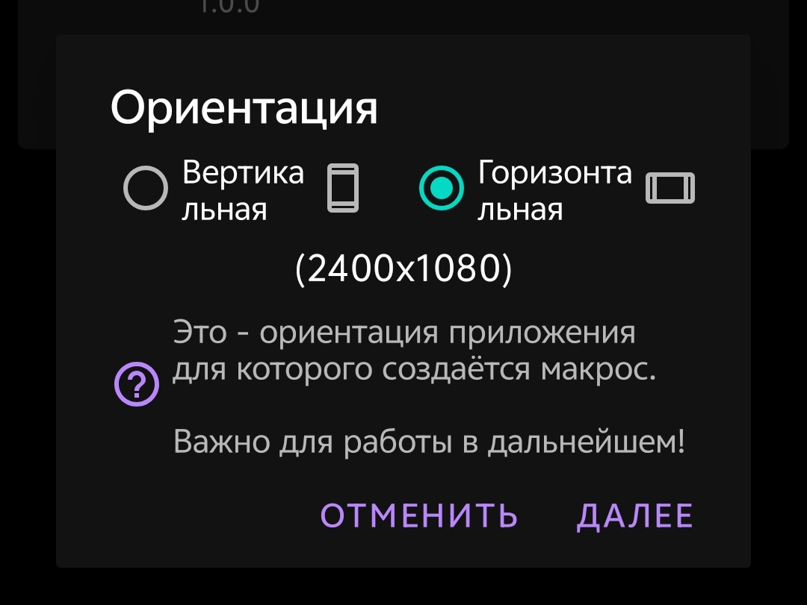
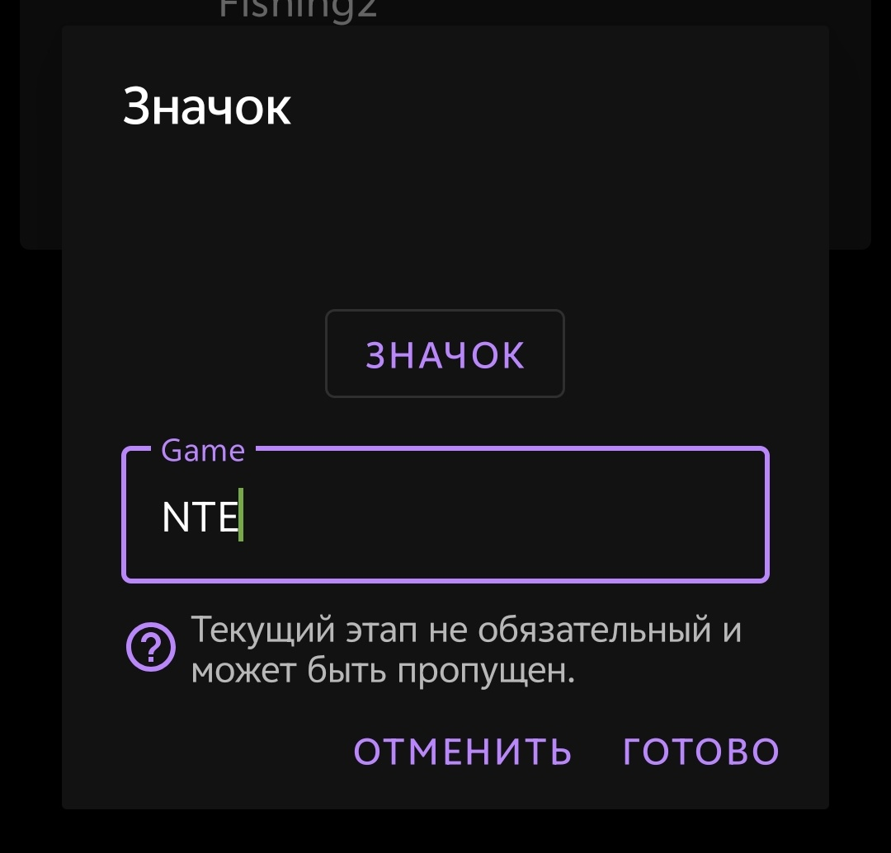
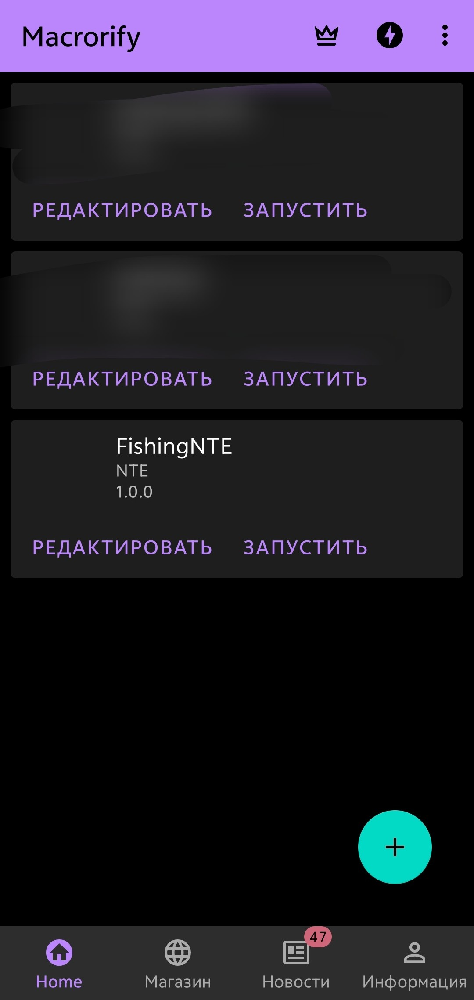
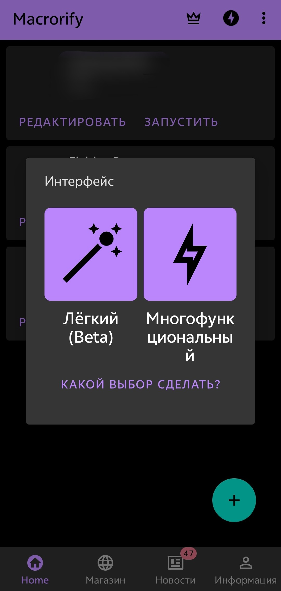
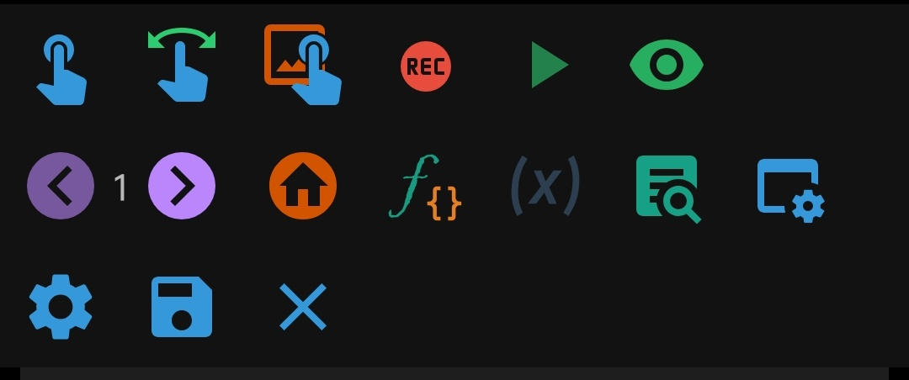
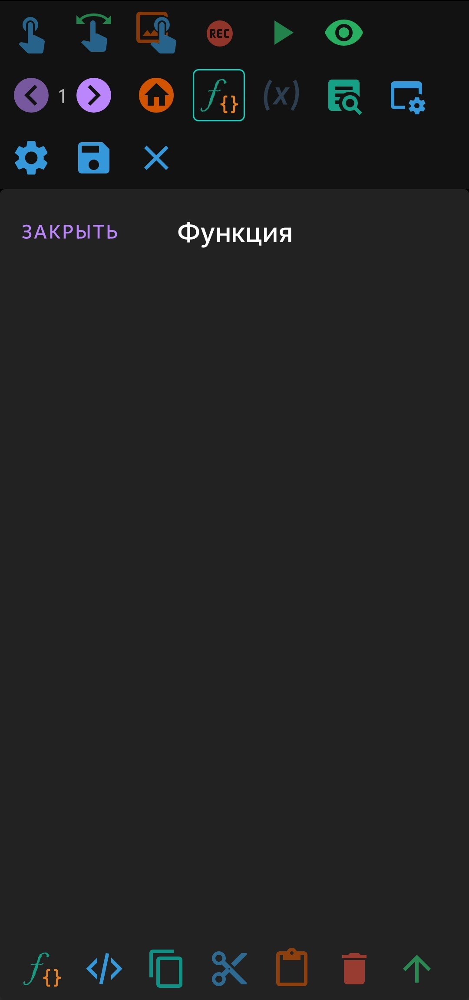
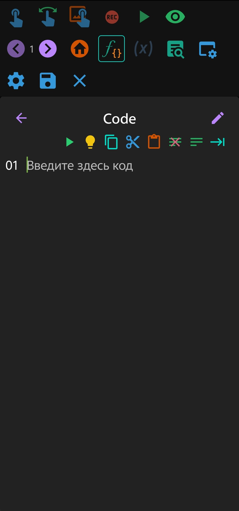
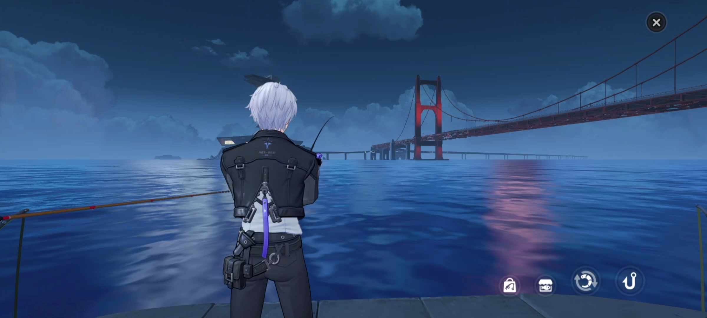

# NTE-scripts

Подборка скриптов, которые помогают сделать игру в NTE на Android удобнее, быстрее и проще.

NTE-scripts это коллекция различных скриптов, которые упрощают игру в NTE на Android.

Репозиторий создан для хранения полезных решений, заметок и вспомогательных материалов, связанных с Android версией NTE.

  
  
  
  

## Содержание

1. [Дисклеймер](#дисклеймер)
2. [Установка](#установка)
3. [Список скриптов](#список-скриптов)
4. [Рекомендации](#рекомендации)
5. [Лицензия](#лицензия)

## Дисклеймер

Материалы в этом репозитории предназначены для ознакомления, личного использования и тестирования.

Автор не несет ответственности за возможные последствия использования скриптов. Все действия выполняются пользователем самостоятельно и на свой риск.

NTE-scripts является неофициальным пользовательским проектом и не связан с разработчиками или издателями NTE.

Использование автоматизации может противоречить правилам игры или условиям использования сервиса. Автор проекта не несет ответственности за возможные ограничения аккаунта, потерю прогресса или другие последствия, связанные с использованием скриптов.

## Установка

1. Скачать Macroify с <a href="https://play.google.com/store/apps/details?id=com.kok_emm.mobile&hl=ru&pli=1">play market</a>.

2. Выдать все разрешения Macroify, которые он запрашивает.

3. Создать новый скрипт и выбрать ему название.
 

4. Выбрать горизонтальную ориентацию.
 

5. Выбрать название игры "NTE".
 

6. В главном меню появится наш скрипт, нужно нажать редактировать.
 

7. Нужно выбрать "многофункциональный" режим.
 

8. Открыть меню редактора скриптов и нажать на значок ƒ{}.
 

9. Нажать на второй значок слева "&lt;&gt;".
 

10. В редакторе кода вставить код скрипта из txt, скачанного из <a href="https://github.com/Datvex/NTE-scripts/releases">releases</a>.
 

11. После вставки кода необходимо нажать значок дискеты в меню управления и затем выйти из редактора кода.
 

12. После этого нужно нажать значок крестика в панели управления скриптом и выбрать "Сохранить и выйти".

13. После этого нужно нажать кнопку "запуск".
 

14. После этого у нас появится меню, нужно зайти в NTE, открыть нужный режим и там уже в меню управления скриптом нажать на иконку треугольника для запуска скрипта.

## Список скриптов

### 1. Auto-fishing

  

**Auto-fishing** это скрипт автоматизации рыбалки для **NTE** на Android устройствах через **Macroify**.

Скрипт берет на себя повторяющиеся действия во время рыбалки и помогает сделать процесс стабильнее, быстрее и удобнее без постоянного ручного контроля. Он автоматически выполняет основной цикл рыбалки, ожидает реакцию игры, нажимает нужные элементы и повторяет процесс после завершения попытки.

Для запуска достаточно установить Macroify, импортировать скрипт, открыть рыбалку в NTE, выбрать наживку и запустить скрипт через меню управления.

## Рекомендации

Для стабильной работы скриптов рекомендуется:

* не менять положение интерфейса во время работы
* не сворачивать игру
* отключить всплывающие уведомления
* использовать стабильное интернет соединение
* заранее подготовить достаточное количество нужных ресурсов
* не запускать другие приложения поверх игры

## Лицензия

Проект распространяется под лицензией **GPL 3.0**.

Подробнее смотрите в файле <a href="./LICENSE">LICENSE</a>.
